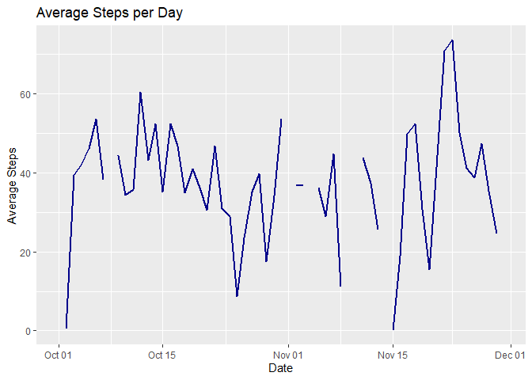
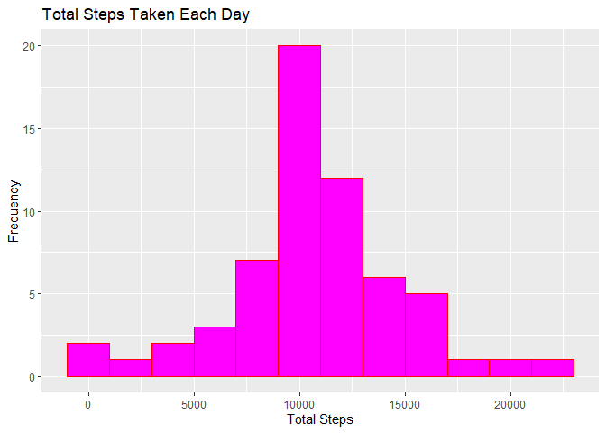
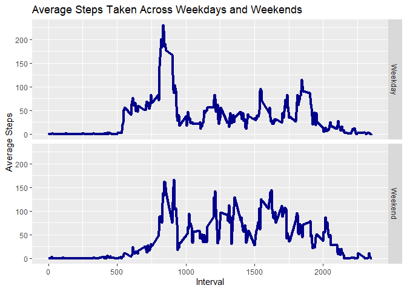

# Reproducible Research - Week 2 Project

============================================================================================

## 1) Code for reading in the data set

```r
setwd("C:/Users/Marcel/Documents/DataScience/Course5")
if(!file.exists("Project1")) {
  
   dir.create("Project1")}

setwd("Project1")
unzip("repdata_data_activity.zip")

library(readr)

repdata <- read_csv("activity.csv")
```

```
## Parsed with column specification:
## cols(
##   steps = col_double(),
##   date = col_date(format = ""),
##   interval = col_double()
## )
```


## 2) Histogram of the total number of steps taken each day.

```r
total_steps <- aggregate(repdata$steps, by= list(repdata$date), FUN=sum, na.rm= TRUE)
colnames(total_steps) <- c("Date", "Steps")

library(ggplot2)


ggplot(total_steps, aes(Steps)) + geom_histogram(color="orange", fill="yellow", binwidth = 2000) + labs(x="Total Steps", y="Frequency") + ggtitle("Total Steps Taken Each Day")
```

<!-- -->


## 3) Mean and median number of steps taken each day.

```r
meanSteps <- mean(total_steps$Steps, na.rm = TRUE)
print(meanSteps)
```

```
## [1] 9354.23
```

```r
medianSteps <- median(total_steps$Steps, na.rm = TRUE)
print(medianSteps)
```

```
## [1] 10395
```


## 4) Time series plot of the average number of steps taken.

```r
library(dplyr)
```

```
## 
## Attaching package: 'dplyr'
```

```
## The following objects are masked from 'package:stats':
## 
##     filter, lag
```

```
## The following objects are masked from 'package:base':
## 
##     intersect, setdiff, setequal, union
```

```r
timeSeries <- repdata %>% group_by(date) %>% summarize(Average.Steps = mean(steps, na.rm = TRUE))


ggplot(timeSeries, aes(x= date, y= Average.Steps)) + 
      geom_line(size=1, color="darkblue") +
      labs(x = "Date", y ="Average Steps") +
      ggtitle("Average Steps per Day")
```

```
## Warning: Removed 2 rows containing missing values (geom_path).
```

<!-- -->


## 5) The 5-minute interval that, on average, contains the maximum number of steps.

```r
repdata %>% group_by(interval) %>% summarize(Average.Steps = mean(steps, na.rm = TRUE)) %>% filter(Average.Steps == max(Average.Steps))
```

```
## # A tibble: 1 x 2
##   interval Average.Steps
##      <dbl>         <dbl>
## 1      835          206.
```


## 6) Code to describe and show a strategy for imputing missing data.

```r
totalNA <- sum(is.na(repdata))
totalNA
```

```
## [1] 2304
```

```r
intervalMean <- repdata %>% group_by(interval) %>% summarize(Mean.Interval = mean(steps,  na.rm = TRUE))

repdata$complete.steps <- ifelse(is.na(repdata$steps),              round(intervalMean$Mean.Interval[match(repdata$interval,   intervalMean$interval)],0),repdata$steps)

repdataComplete <- data.frame(repdata$complete.steps, repdata$date, repdata$interval)
colnames(repdataComplete) <- c("Steps", "Date", "Interval")
head(repdataComplete)
```

```
##   Steps       Date Interval
## 1     2 2012-10-01        0
## 2     0 2012-10-01        5
## 3     0 2012-10-01       10
## 4     0 2012-10-01       15
## 5     0 2012-10-01       20
## 6     2 2012-10-01       25
```


## 7) Histogram of the total number of steps taken each day after missing values are imputed.

```r
stepsDay <- repdataComplete %>% group_by(Date) %>% summarize(Total.Steps = sum(Steps))


ggplot(stepsDay, aes(Total.Steps)) + geom_histogram(color="red", fill="magenta", binwidth = 2000) + labs(x= "Total Steps", y="Frequency") + ggtitle("Total Steps Taken Each Day")
```

<!-- -->

```r
meanStepsComplete <- mean(stepsDay$Total.Steps)
print(meanStepsComplete)
```

```
## [1] 10765.64
```

```r
medianStepsComplete <- median(stepsDay$Total.Steps)
print(medianStepsComplete)
```

```
## [1] 10762
```


## 8) Panel plot comparing the average number of steps taken per 5-minute interval across weekdays and weekends.

```r
repdataComplete$Day.Name <- weekdays(repdataComplete$Date)

repdataComplete$Classification <- ifelse(repdataComplete$Day.Name == "Saturday" | repdataComplete$Day.Name == "Sunday", "Weekend", "Weekday")
head(repdataComplete)
```

```
##   Steps       Date Interval Day.Name Classification
## 1     2 2012-10-01        0   Monday        Weekday
## 2     0 2012-10-01        5   Monday        Weekday
## 3     0 2012-10-01       10   Monday        Weekday
## 4     0 2012-10-01       15   Monday        Weekday
## 5     0 2012-10-01       20   Monday        Weekday
## 6     2 2012-10-01       25   Monday        Weekday
```

```r
timeSeriesClassification <- repdataComplete %>% group_by(Interval, Classification) %>% summarize(Interval.Steps.Mean = mean(Steps))
head(timeSeriesClassification)
```

```
## # A tibble: 6 x 3
## # Groups:   Interval [3]
##   Interval Classification Interval.Steps.Mean
##      <dbl> <chr>                        <dbl>
## 1        0 Weekday                      2.29 
## 2        0 Weekend                      0.25 
## 3        5 Weekday                      0.4  
## 4        5 Weekend                      0    
## 5       10 Weekday                      0.156
## 6       10 Weekend                      0
```

```r
ggplot(timeSeriesClassification, aes(Interval, Interval.Steps.Mean)) + geom_line(size=1.5, color= "darkblue") + facet_grid(Classification~.) + labs(x="Interval", y="Average Steps") + ggtitle("Average Steps Taken Across Weekdays and Weekends")
```

<!-- -->

